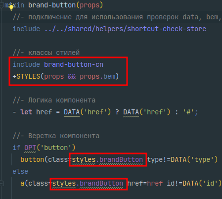
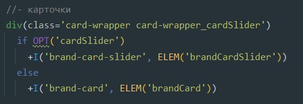
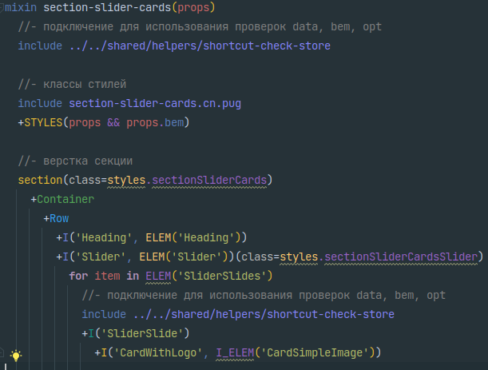
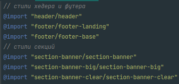
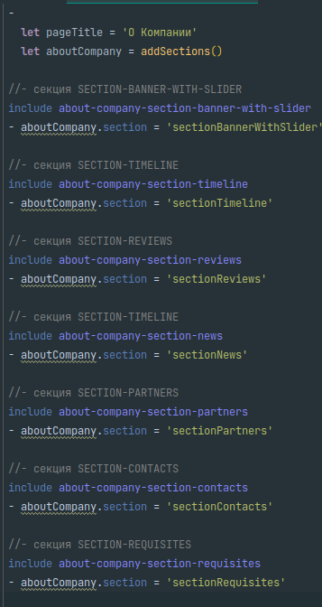

# КРЕДИТ ЕВРОПА БАНК

## Версия Node.js - v22.2.0

## Структура проекта
### Проект состоит из двух вариантов страниц:
Разводящая страница list-pages.pug(./app/list-pages/list-pages.pug) - в неё добавляется созданная страница!

## Используемые технологии в проекте
Данный проект реализован с помощью композиции **Webpack**, SASS, TS, PUG, BEM ClassName

### STORE и вспомогательные функции для работы с данными
Каждый STORE состоит из функциональных элементов DATA, CN, ELEM, OPT, DATA_ARR, ELEM_ARR
```
elem: {
	BrandParagraphData: {
		data: {
			text: 'Данные элемента',
			id: 15,
			dataSwipe: 'data-attribute'
		},
		elem: {
			NameComponent: {
				data: {
					...Дублирует структуру data
				},
				... и тд
			},
			NameComponentArr: [
				{
					data: {
						...Дублирует структуру data
					},
					... и тд
				}
			},
			{
					data: {
						...Дублирует структуру data
					},
					... и тд
				}
			}
		],
		cn: {
			color: 'red',
			isRadius: true
		},
		opt: {
			isChildClass: true
		},
		dataArr: {
			inputArr: [
				{
					data: 'test'
				}
			]
		}
	},
```
- data - блок с данными, в который передаются данные, такие как текст, url, src к картинкам и т.д.;
- cn - блок с БЭМ логикой, в который передаются модификаторы, классы;
- elem - в данный блок передаются компоненты. У компонента могут быть свои data, cn, elem, opt, dataArr;
- opt - логический блок, принимает параметры, у которых значение может быть либо true, либо false;
- dataArr - блок массивов, принимает в себя блоки кода/компоненты, которые необходимо итерировать в цикле.

Для того, чтобы они воспринимались в коде необходимо прокинуть вспомогательные функции при верстке


Для работы с массивом данных в сторе используется массив dataArr
```
dataArr: {
	inputArr: [
		{
			data: {
				text: 'Главная'
			}
		},
		{
			data: {
				text: 'Новости'
			}
		}
	]
}

```
И для доступа к его внутренним элементам к функциональным элементам **I_**(I_DATA, I_BEM...)


## Архитектура приложения - Feature-Sliced
- **shared** _(Простые компоненты **ui**)_ — многоразовый функционал, оторванный от специфики проекта/бизнеса.
- **entities** _(Составные компоненты **components**)_ — бизнес-сущности (например, Пользователь, Продукт, Заказ).
- **features** _(Составные компоненты с бизнес-логикой)_ — взаимодействие с пользователем, действия, которые приносят бизнес-ценность пользователю.
- **widgets** _(Секции **sections**)_ — композиционный слой для объединения объектов и функций в значимые блоки.
- **pages** _(Страницы)_ — композиционный слой для создания полных страниц из сущностей, функций и виджетов.


## Создание компонентов

### Верстка компонентов
- src/components - (Компоненты с логикой, могут использовать в себе ui-компоненты)
- src/shared/ui - (Маленькие ui компоненты которые не могут быть составлены из других компонентов)

Работа с данными в компоненте происходит путем передачи данных стора в виде **props**!

Классы в компоненте создаются в файле [NAME_COMPONENT].cn.pug по методологии bem-className от компании Яндекс (https://ru.bem.info/technologies/bem-react/classname/).
Модификаторы к классу задаются в { }, дополнительные классы задаются в [ ].


Далее миксин STYLES подключается к компоненту и используется в определении классов в версте



Любой компонент состоит из файла pug, [NAME_COMPONENT].cn.pug и scss

Верстка компонента делается в файлах pug и [NAME_COMPONENT].cn.pug.

### Подключение компонентов

После создания компонента необходимо подключить:
1. pug файл(../components/components.pug)


2. scss файл(../components/components.scss)


3. После этого данный компонент может использоваться в верстке секции


4. В конце он добавляется на страницу, где будет использоваться


## Создание секции

### Верстка секции(../sections)

Работа с данными в секции происходит путем передачи данных стора в виде **props**!

Верстка секции происходит в форме mixin, в котором используются компоненты и pug элементы. Пример секции:



Любая секция состоит из файла pug, [NAME_COMPONENT].cn.pug и sass
1. Классы для секции задаются в [NAME_COMPONENT].cn.pug секции, которые потом в неё подключаются (подключение аналогично подключению в компоненте)
2. Стили секции описываются в scss файле
3. Верстка секции в основном pug файле.
4. После этого стили секции нужно подключить в основной файл стилей всех секций(section.scss)


5. Затем сама секция подключается на страницу, где используется


## Создание страницы


- Основной файл (например about-company.pug)
1. В нем подключаются layout для страницы

2. Собирается общий store, состоящий из сторов секций(внутри файла стора секции находятся данные, которые используются для верстки секций)


3. В pug файле страницы подключается общий стор страницы


4. Ниже подключаются секции используемые на странице


### Создание js файлов(../js-modules)
1. При создании используется модульная(экспорт-импорт) система
2. После чего js-файл подключается и вызывается в main.ts


## NPM
```bash
# install dependencies
$ npm install

# serve with hot reload at localhost:3000
$ npm start
# build for production to /build
$ npm run build

# watch for changes and deploy it to server (from ./accesses)
$ npm run server
```

## Работа с TypeScript

+ Для имен переменных и функций используем `camelCase`, например `fooVar`, `getItem()`
+ Для имен классов, типов и интерфейсов используем `PascalCase`, например `class CarController`
+ Для интерфейсов добавляем преписку `I`, например `IUser`
+ Для типов добавляем преписку `Type`, например `TypeArray`
+ Для `enum` используес `PascalCase`
+ Ставим пробел после присвоения типа, например `const foo: string = 'hello'`
+ Описываем массивы как `array: Foo[] ` вместо `array: Array<Foo>`.
+ Именуем файлы `ts` в `camelCase`, например `accordion.tsx`, `myControl.tsx`, `utils.ts`, `map.ts` и т.д.


## Работа с репозиторием и ветками
Основной репозиторий разбит на:
+ Frontend(После сборки - папка build)
+ Backend(Заменяется содержимым из папки Frontend/build)

### Инструкция по работе с git проекта

**1.** Всю работу начинаем с ветки **'master'** с последующим ответвлением от неё.
`(git checkout master)`

**2.** В первую очередь надо проверить актуальность ветки **'master'** и вслучае не актуальности подтянуть из удаленного репозитория.
`(git status; git pull)`

**3.** Когда задача (таска) берется в работу всегда необходимо всегда ответвляться от ветки **'master'**.
`(git checkout -b <name branch>)`

**4.** Под каждую задачу создаешь отдельную ветку именуя номером задачи из таска и словами описывающими заголовок из таска на английском. *Пример: 'Task-36991-130-no-scroll'*.
`(git checkout -b Task-36991-130-no-scroll)`

**5.** По завершению выполнения задачи обязательно надо создать merge request с задачей в ветку **'revision'**.
`(отправляем merge request в GitLab`)

**6.** После тестирования и проверки *задачи* на **revision** ветке необходимо смерджить **ветку Revision** в ветку **master** `(отправляем merge request в GitLab`)`


## sass-lint
sass-lint работает по схеме
- Box
  - Блок включает в себя любое свойство, влияющее на отображение и положение блока
  - К примеру: display, float, position, left, top, height, width
- Border
  - Все что связанно с бордером
  - border, border-image, border-radius и т.д.
- Background
  - Все что связанно с фоном
  - Пример background, background-color, background-image, background-size
- Text
  - Пример font-family, font-size, text-transform, letter-spacing
- Other
  - Все остальное

## Работа с ветками для gitlab-pages
- Ответвляемся от ветки `master` для реализации рабочей таски по ТЗ.
- Называем ветку в соответствие с задачей из ActiveCollabe. Пример `Task-50553-444-xxxx-xx-x`
- После реализации задачи переносим рабочую ветку на `develop` и пушим.
- Билдим ветку `develop` и переносим билд в одноименную папку названную с веткой - `develop`.
- Отдаем на проверку менеджеру/дизайнеру/тестировщику.
- После проверки и успешно выполненной задачи переносим рабочую ветку с задачей на ветку `pre-production` и пушим.
- Билдим ветку `pre-production` и переносим билд в одноименную папку названную с веткой - `pre-production`.
- Отдаем бекенд разработчику для переноса на его тестовый стенд, чтобы показать заказчику перед переносом в ветку `master`.
- После тестирования на тестовом стенде у бекенда переносим переносим рабочую ветку с задачей на ветку `master` пушим и удаляем рабочую ветку.
- **Обязательно по всем стадиям пишем в ActiveCollabe и предоставляем ссылки на коммиты и front-end страницы из gilab-pages.**
